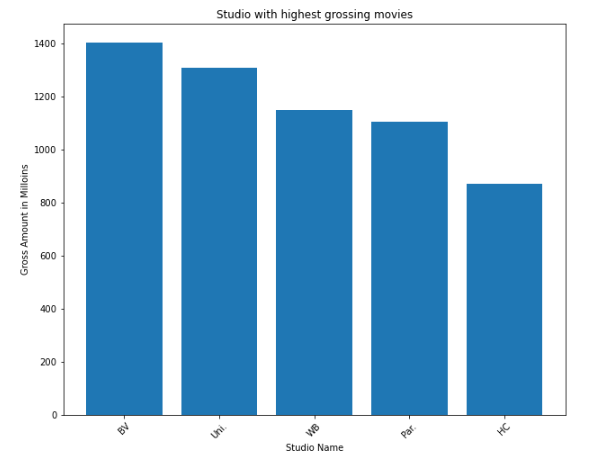
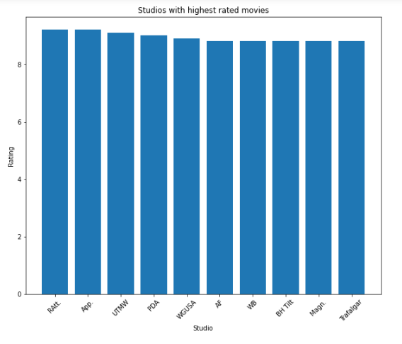
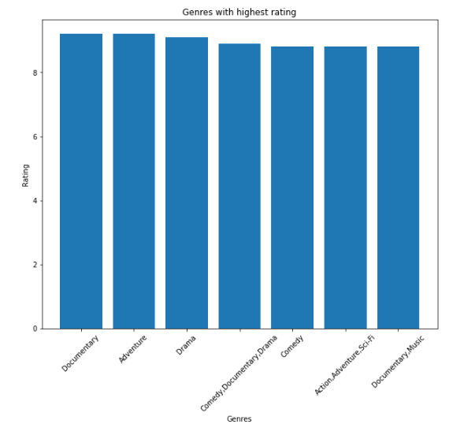
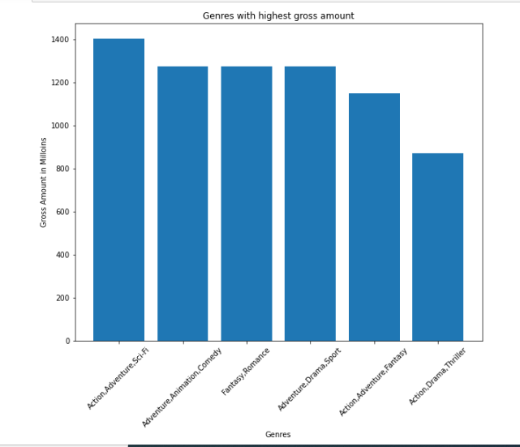

Overview 
    
 Business Understanding

Microsoft sees all the big companies creating original video content and they want to get in on the fun. They have decided to create a new movie studio, but they don’t know anything about creating movies. You are charged with exploring what types of films are currently doing the best at the box office. You must then translate those findings into actionable insights that the head of Microsoft's new movie studio can use to help decide what type of films to create.
 
   Stakeholder and key business questions
        
   Goals
        Find out:
        1. Which movie genres make the highets profit?
        2. Which movie genres have the highest rating?
        3. Which studios produce movies with the highest rating or highest gross?
   
   
   Data Understanding and Analysis
      * Source of data
          Data was provided by Moringa
   
       
  Description of data
         
   im.db - Database containing information about movies. Tables to be use are:
                1. Movie_basics - has 146144 rows × 6 columns with information such as title and genre
                2. movie_ratings - has information on average rating and number of votes
           bom.movie_gross.csv - csv file with movies' domestic and foreign gross.
   Three visualizations (the same visualizations presented in the slides and notebook)
        
        
        
        
        
    
    * Conclusion
       
Conclusions

Average rating for a movies is 6.4. Highest rated movie 'The Wall' is a Documentary with a 9.2 rating and lowest rated 'Justin Bieber: Never Say Never' is also a documentary with music, with a rating of 1.6.

Genres with highest domestic gross
Action,Adventure,Sci-Fi,Animation,Comedy

Genres with highest foreign gross
Action,Adventure,Sci-Fi Adventure,Animation,Comedy

Genres with the highst total gross
Action,Adventure,Sci-Fi Adventure,Animation,Comedy

Genres with the highst rating
Documentary,adventure,Drama,Comedy, action

Studios with highest rated movies
RAtt, App, UTMW, PDA, WGUSA, AF

Studio with highest grossing movies
BV. Uni, WB, Par, HC
         
         
         * Summary of conclusions including three relevant findings
   
   1. To make a good profit Microsoft studio should create movies in genres of Action,Adventure,Sci-Fi,Animation,Comedy. They should collaborate with studioes named BV. Uni, WB, Par, HC.

2. To have the best rated movies they should focus on Documentary,adventure,Drama,Comedy,action genres and collaborate with studios such as RAtt, App, UTMW, PDA, WGUSA, AF.

3. Microsoft studio should not focus on movie runtime because there is a low correlation between runtime and totalgross and also rating.